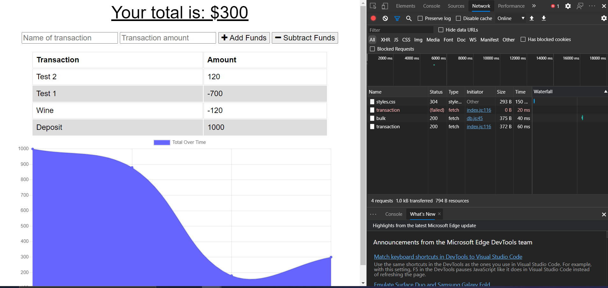

# Online/Offline Budget Trackers

A web application where users will be able to add and subtract expenses in order for them to manage their budget. The application works both online and offline with the aid of a web manifest and an indexedDB.

## Usage

To run this application locally, you should:

1. Clone this repository to your computer
2. Go to the project directory on your terminal
3. Run "npm install" on your terminal to install the dependencies
4. Run "node server.js"
5. Enjoy

## Screenshots of application

## Link to Demo Video

https://drive.google.com/file/d/18HRnLTZhEMUEpsGqLmiWOZj43c5QK9oa/view

## Application URL

https://glacial-savannah-33369.herokuapp.com/
